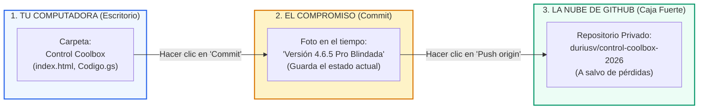

# Plan Maestro: Escalamiento en GitHub para Principiantes

**Sistema:** Control Operativo de Mantenimiento Preventivo e Inventario Anual Coolbox 2026  
**Empresa Ejecutora:** **JSERVICE RV E.I.R.L.**  
**Cliente Corporativo:** **Coolbox (RASH PERÚ S.R.L.)**  
**Usuario de GitHub:** `duriusv`  
**Repositorio Remoto Privado:** [`https://github.com/duriusv/control-coolbox-2026.git`](https://github.com/duriusv/control-coolbox-2026)  
**Herramienta Visual:** **GitHub Desktop** (Ya instalada y abierta en tu PC)  
**Nivel de Experiencia del Usuario:** Principiante Absoluto (Cero experiencia previa en Git)  
**Estado:** Plan Metodológico Adaptado en Revisión (Modo `/plan`)

---

## 1. Goal Description (¿Qué vamos a lograr?)

Vamos a conectar tu proyecto real que está en tu escritorio (**`c:\Users\HP\Desktop\Control Coolbox`**, versión `v4.6.5 Pro` blindada) con tu repositorio privado que ya creaste en GitHub (**`duriusv/control-coolbox-2026`**).

Usaremos la aplicación **GitHub Desktop** que ya tienes abierta en tu pantalla para que **NO tengas que escribir ningún comando difícil en pantallas negras**. Todo se hará con clics de ratón, botones azules y explicaciones sencillas.

---

## 2. Anatomía de tu Pantalla Actual de GitHub Desktop

En la imagen que subiste, estás exactamente en la pantalla inicial de bienvenida de **GitHub Desktop**:


### ¿Qué significa cada parte de lo que estás viendo?

1. **A la izquierda (`🔒 duriusv/control-coolbox-2026`):**
   * Es tu repositorio en internet. El candado cerrado (**🔒**) significa que es **100% PRIVADO**: nadie en el mundo puede ver tu código, tus tiendas ni tus clientes excepto tú.
2. **El botón azul inferior (`Clone duriusv/control-coolbox-2026`):**
   * > [!WARNING]
     > **NO HAREMOS CLIC AQUÍ.** Si haces clic en "Clone", GitHub creará una carpeta vacía en otra parte de tu disco duro (ej. en `Mis Documentos`), y tendrías dos carpetas duplicadas. Tu proyecto real ya existe y está en tu Escritorio: `C:\Users\HP\Desktop\Control Coolbox`.
3. **El botón de la derecha (`Add an Existing Repository from your local drive...`):**
   * > [!TIP]
     > **¡ESTE ES EL BOTÓN MÁGICO QUE USAREMOS!** Con esta opción le diremos a GitHub Desktop: *"Mi código real ya está en mi Escritorio, conecta directamente esa carpeta con mi cuenta"*.

---

## 3. Glosario Amigable: Conceptos de GitHub para Humanos

Para que nunca más te sientas perdido en GitHub, estos son los 4 únicos conceptos que necesitas conocer:



* **1. Repositorio (Repository):** Es tu "caja fuerte digital" en la nube de GitHub donde se guardan tus archivos. Tu repositorio se llama `control-coolbox-2026`.
* **2. Commit (Foto en el tiempo):** Es como presionar "Guardar Como..." pero profesional. Cada vez que hacemos un cambio, le tomamos una foto al proyecto con un título (ejemplo: *"Versión 4.6.5 Pro - Blindajes Fase 7"*). Si en el futuro algo se rompe, podemos regresar a esa foto exacta con 1 clic.
* **3. Push (Subir a la nube):** Es el botón que envía la foto y los archivos desde tu computadora hacia los servidores de GitHub en internet.
* **4. `.gitignore` (El Escudo Protector):** Un archivo invisible que le dice a GitHub qué cosas **NO** debe subir (por ejemplo, carpetas temporales de pruebas pesadas que no forman parte de la aplicación).

---

## 4. El Plan de Escalamiento Metodológico (Módulos 1 al 4)

---

### MÓDULO 1: Higiene y Creación del Escudo `.gitignore` y `README.md`
*(Este módulo lo prepara Antigravity en 5 segundos automáticamente)*

#### ¿EL QUÉ?
Antes de vincular la carpeta, debemos colocar un archivo escudo `.gitignore` y una carátula oficial `README.md` para que tu repositorio en GitHub tenga una presentación de nivel corporativo internacional.

#### ¿EL CÓMO?
1. **Crear `.gitignore`:** Le ordenará a Git ignorar:
   - `scratch/` (más de 65 archivos de pruebas temporales que pesan varios megabytes).
   - `.gemini/` y archivos basura de Windows (`Thumbs.db`, `.DS_Store`).
2. **Crear `README.md`:** La ficha técnica formal del proyecto con:
   - Título oficial: `JService Ops 2026 for Coolbox v4.6.5 Pro`.
   - Razón social: `JSERVICE RV E.I.R.L.`.
   - Cliente: `Coolbox (RASH PERÚ S.R.L.)`.
   - Cobertura: 147 tiendas a nivel nacional.
   - Resumen de arquitectura: Google Workspace (Sheets, Drive 5TB, Apps Script) + Web App Offline-First.
3. **Inicializar Git localmente:** Configuraremos la carpeta `C:\Users\HP\Desktop\Control Coolbox` apuntando a tu URL remota `https://github.com/duriusv/control-coolbox-2026.git`.

#### ¿QUÉ PASARÁ?
Tu carpeta quedará lista con su "carnet de identidad" de Git sin que tú tengas que escribir ningún comando.

---

### MÓDULO 2: Vinculación con GitHub Desktop (Paso a Paso con el Ratón)
*(Este módulo lo realizas tú cómodamente con 3 clics en la pantalla que tienes abierta)*

#### ¿EL QUÉ?
Hacer que la ventana de GitHub Desktop que tienes en tu pantalla reconozca la carpeta `Control Coolbox` de tu escritorio.

#### ¿EL CÓMO? (Guía de Clics Exactos)

1. En la ventana de GitHub Desktop que tienes abierta (la de tu captura):
   - Haz clic en el botón: **`Add an Existing Repository from your local drive...`**  
     *(O en el menú superior: haz clic en `File` ➔ `Add local repository...` o presiona `Ctrl + O`)*.
2. Se abrirá una pequeña ventana pidiéndote la ruta (*Local path*):
   - Haz clic en el botón **`Choose...`** (Examinar).
   - Busca en tu Escritorio la carpeta **`Control Coolbox`** (`C:\Users\HP\Desktop\Control Coolbox`).
   - Haz clic en **`Seleccionar carpeta`**.
3. Haz clic en el botón azul **`Add repository`**.

#### ¿QUÉ PASARÁ?
La pantalla de bienvenida cambiará inmediatamente a la vista de trabajo principal de GitHub Desktop: verás la lista de todos tus archivos a la izquierda (`index.html`, `Codigo.gs`, imágenes, carpetas) listos y seleccionados con casillas verdes.

---

### MÓDULO 3: El Primer Commit y la Subida a la Nube (Push)
*(El momento en que tu código queda 100% a salvo en internet)*

#### ¿EL QUÉ?
Empaquetar todo el sistema `v4.6.5 Pro` y enviarlo a tu repositorio privado `duriusv/control-coolbox-2026`.

#### ¿EL CÓMO?

1. En la esquina inferior izquierda de GitHub Desktop verás un recuadro de texto que dice **`Summary (required)`**:
   - Escribe ahí: **`Version 4.6.5 Pro - Sistema Blindado Fase 7`**.
   - *(Opcional)* En la casilla de descripción debajo puedes poner: *`Subida oficial del ecosistema JService Ops 2026 for Coolbox con los 4 blindajes de campo implementados.`*
2. Justo debajo, haz clic en el botón azul:  
   **`Commit to main`** (o `Commit to master`).
3. Una vez hecho el commit, en la parte superior derecha de GitHub Desktop aparecerá un botón azul grande con una flecha hacia arriba que dice:  
   **`Publish branch`** (o **`Push origin`**).
4. **Haz clic en ese botón azul.**
   - Como ya iniciaste sesión con tu cuenta `duriusv`, GitHub Desktop no te pedirá ninguna contraseña ni token: subirá todo automáticamente en 10 o 20 segundos.

#### ¿QUÉ PASARÁ?
Aparecerá un mensaje de éxito indicando que el repositorio está sincronizado.  
Si abres tu navegador web y entras a [`https://github.com/duriusv/control-coolbox-2026`](https://github.com/duriusv/control-coolbox-2026), **verás todos tus archivos en la nube con su manual `README.md` visible**, perfectamente respaldados bajo tu candado privado.

---

### MÓDULO 4: Tu Rutina Diaria a Partir de Hoy (La Regla de los 2 Clics)

A partir de este momento, cada vez que Antigravity o tú hagan una mejora en el sistema, nunca más tendrás miedo de romper nada. Esta será tu rutina:

```text
┌──────────────────────────────┐
│ 1. Antigravity hace una      │
│    mejora o tú guardas un    │
│    archivo.                  │
└──────────────┬───────────────┘
               │
               ▼
┌──────────────────────────────┐
│ 2. Abres GitHub Desktop      │
│    (detecta automáticamente   │
│    qué líneas cambiaron en   │
│    verde y rojo).            │
└──────────────┬───────────────┘
               │
               ▼
┌──────────────────────────────┐
│ 3. Escribes un título corto  │
│    y haces clic en:          │
│    [Commit to main]          │
└──────────────┬───────────────┘
               │
               ▼
┌──────────────────────────────┐
│ 4. Haces clic en:            │
│    [Push origin]             │
│    ¡Y todo queda respaldado! │
└──────────────────────────────┘
```

Si en 6 meses alguien borra un archivo por accidente, bastará con abrir GitHub Desktop, mirar el historial (*History*), hacer clic derecho en la fecha deseada y presionar *"Revert changes"*. El sistema regresará a la normalidad en 1 segundo.

---

## 5. Plan de Verificación

### Pruebas Automatizadas (Ejecutadas por Antigravity)
1. Comprobar que `.gitignore` excluye correctamente las carpetas pesadas y temporales.
2. Comprobar que la configuración de Git local apunta exactamente a `https://github.com/duriusv/control-coolbox-2026.git`.
3. Comprobar que la rama principal está configurada como `main`.

### Verificación Visual en GitHub Desktop (Por el Usuario)
1. Abrir GitHub Desktop y verificar que la carpeta `Control Coolbox` aparece en la lista de repositorios locales.
2. Realizar el commit y presionar `Push origin`.
3. Abrir en el navegador [https://github.com/duriusv/control-coolbox-2026](https://github.com/duriusv/control-coolbox-2026) y certificar que aparecen `index.html`, `Codigo.gs`, el directorio `Control Coolbox Admin/` y el archivo `README.md`.

---

## 6. Aprobación Requerida

¿Apruebas que Antigravity ejecute de inmediato el **Módulo 1** (creación del `.gitignore`, creación del `README.md` corporativo e inicialización local del enlace hacia `https://github.com/duriusv/control-coolbox-2026.git`) para que luego tú hagas los 2 clics en tu ventana de GitHub Desktop?
