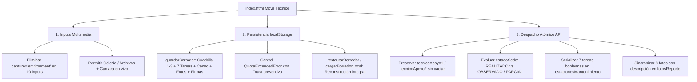

# Implementation Plan — Blindaje Atómico y Optimización Multimedia en index.html (Técnico)

Este plan detalla las modificaciones quirúrgicas sobre la aplicación web móvil del técnico (`index.html` en la raíz del repositorio), sincronizándola al 100% con la arquitectura atómica de `Codigo.gs` v4.0 y resolviendo las necesidades operativas de campo en la toma de fotos, persistencia offline y cierre de reportes.

---

## 1. Goal Description
El objetivo es optimizar y blindar la aplicación de campo del técnico Coolbox 2026:
1. **Flexibilidad Multimedia:** Eliminar el atributo `capture="environment"` de los 10 inputs de tipo file (`#inputFotoAntes`, `#inputFotoDespues`, y `#inputFoto_1` a `#inputFoto_8`), conservando `accept="image/*"`. Esto permite al técnico elegir en su dispositivo móvil entre abrir la cámara en vivo o cargar imágenes tomadas previamente desde la galería o explorador de archivos.
2. **Blindaje de Persistencia Local (`localStorage`):** Asegurar que `guardarBorrador` y `restaurarBorrador` capturen y reconstituyan de forma exhaustiva: tienda seleccionada, cuadrilla técnica completa (`tecnico1`, `tecnico2`, `tecnico3`), checklists y fotos de gabinete, las 7 tareas booleanas por estación de cómputo, censo integral de activos (POS, PDAs, inalámbricas, rack, almacén y de baja), fotos en Base64 y firmas digitales sobre canvas, incorporando manejo de `QuotaExceededError` con notificación flotante (toast) preventiva.
3. **Payload Atómico de Cierre en `finalizarYReportarServicio` / `enviarAtencionFinal`:**
   - Garantizar la transmisión explícita de `tecnico`, `tecnicoApoyo1` y `tecnicoApoyo2` recuperados del DOM o estado activo sin sobreescribirlos con cadenas vacías.
   - Evaluar con precisión el estado de entrega en campo: enviar estrictamente `estadoSede: "REALIZADO"` cuando el gabinete esté conforme (con fotos antes/después), todas las estaciones tengan sus 7 tareas en `true`, existan firmas digitales y no haya observaciones críticas. En caso contrario, enviar `estadoSede: "OBSERVADO / PARCIAL"`. Queda terminantemente PROHIBIDO enviar `"PENDIENTE"`.
   - Serializar `estacionesMantenimiento` conteniendo las 7 tareas canónicas booleanas (`limpiezaAIO`, `cambioPastaTermica`, `limpiezaTicketera`, `limpiezaImpresora`, `limpiezaLector`, `limpiezaGaveta`, `ordenCables`).
   - Sincronizar el arreglo canónico de 8 evidencias bajo `fotosReporte` con sus descripciones actualizadas desde el DOM (`#descFoto_1` a `#descFoto_8`).

---

## 2. User Review Required

> [!IMPORTANT]
> **Alineación con el Backend Codigo.gs v4.0:**
> En `Codigo.gs`, la función `determinarEstadoSede_(payload)` respeta el valor de `payload.estadoSede` recibido directamente desde el frontend si está presente. Al enviar `"REALIZADO"` u `"OBSERVADO / PARCIAL"`, se previene que la columna G (`ESTADO_MANT`) de `DB_TIENDAS` quede congelada en `"PENDIENTE"`.

> [!TIP]
> **Preservación Inviolable de Multimedia:**
> Los dos logos corporativos embebidos en Base64 (`logo-jservice` con SHA-256 `d77d9eb4...` y `logo-coolbox` con SHA-256 `f1f17453...`) permanecerán 100% inalterados y serán auditados criptográficamente antes y después de aplicar los cambios.

---

## 3. Proposed Changes

### Archivo a Modificar: `index.html` (Raíz)



---

#### 3.1. Remoción de `capture="environment"` en los 10 inputs de archivo

* **Líneas 1857 y 1868 (Fotos Gabinete):**
```html
<!-- ANTES -->
<input type="file" id="inputFotoAntes" accept="image/*" capture="environment" style="display:none" onchange="procesarFoto(this, 'previewAntes', 'dataFotoAntes')">
<input type="file" id="inputFotoDespues" accept="image/*" capture="environment" style="display:none" onchange="procesarFoto(this, 'previewDespues', 'dataFotoDespues')">

<!-- DESPUÉS -->
<input type="file" id="inputFotoAntes" accept="image/*" style="display:none" onchange="procesarFoto(this, 'previewAntes', 'dataFotoAntes')">
<input type="file" id="inputFotoDespues" accept="image/*" style="display:none" onchange="procesarFoto(this, 'previewDespues', 'dataFotoDespues')">
```

* **Líneas 2041, 2061, 2081, 2101, 2121, 2141, 2161, 2181 (Slots 1 a 8 de Evidencias):**
```html
<!-- ANTES (Ejemplo Slot 1 a 8) -->
<input type="file" id="inputFoto_1" accept="image/*" capture="environment" style="display:none;" onchange="procesarFotoReporte(1, this)">
...
<input type="file" id="inputFoto_8" accept="image/*" capture="environment" style="display:none;" onchange="procesarFotoReporte(8, this)">

<!-- DESPUÉS -->
<input type="file" id="inputFoto_1" accept="image/*" style="display:none;" onchange="procesarFotoReporte(1, this)">
...
<input type="file" id="inputFoto_8" accept="image/*" style="display:none;" onchange="procesarFotoReporte(8, this)">
```

---

#### 3.2. Blindaje de `guardarBorrador` y `restaurarBorrador`

* **En `guardarBorrador(mostrarNotificacion = false)` (Líneas ~5969 a ~6055):**
  - Asegurar la lectura y empaquetado de las descripciones de los 8 slots desde el DOM (`#descFoto_1` a `#descFoto_8`).
  - Persistir cuadrilla completa (`tecnico1`, `tecnico2`, `tecnico3`, `checkTec2`, `checkTec3`).
  - Persistir firmas de canvas o de memoria previa.
  - Envolver `localStorage.setItem` en un bloque que detecte cuota excedida (`QuotaExceededError`, `NS_ERROR_DOM_QUOTA_REACHED`, código 22/1014) y dispare:
    ```javascript
    mostrarToastBorrador("⚠️ Límite de memoria local alcanzado. Envíe el reporte o reduzca imágenes.");
    ```
  - Si la cuota se excede, intentar un guardado de rescate de la estructura técnica y de inventario (metadatos sin las cadenas Base64 pesadas) para nunca perder el progreso del servicio.

* **Exposición y Homologación de `restaurarBorrador` (Línea ~6057):**
  - Declarar `window.restaurarBorrador = restaurarBorrador;` y asegurar que `restaurarBorrador()` sea sinónimo o alias de `cargarBorradorLocal()`.
  - Reconstituir las 7 tareas booleanas (`check_aio_`, `check_pasta_`, `check_tick_`, `check_print_`, `check_lec_`, `check_gav_`, `check_cables_`) y las descripciones de las 8 evidencias fotográficas en sus campos de texto respectivos.

---

#### 3.3. Corrección de `enviarAtencionFinal` / `finalizarYReportarServicio`

* **Extracción Robusta de Cuadrilla (Líneas ~7010 a ~7030):**
  ```javascript
  const valorTecnico1 = (document.getElementById("tecnico1") ? document.getElementById("tecnico1").value : "").trim();
  const checkTec2 = document.getElementById("checkTecnico2");
  let valorTecnico2 = "";
  if (checkTec2 && checkTec2.checked && document.getElementById("tecnico2")) {
    valorTecnico2 = document.getElementById("tecnico2").value.trim();
  }
  const checkTec3 = document.getElementById("checkTecnico3");
  let valorTecnico3 = "";
  if (checkTec3 && checkTec3.checked && document.getElementById("tecnico3")) {
    valorTecnico3 = document.getElementById("tecnico3").value.trim();
  }

  // Respaldo defensivo desde borrador si los selectores no estaban visibles
  if (!valorTecnico2 && checkTec2 && checkTec2.checked) {
    try {
      const bObj = JSON.parse(localStorage.getItem('COOLBOX_BORRADOR_SERVICIO') || '{}');
      if (bObj.tecnico2) valorTecnico2 = bObj.tecnico2.trim();
    } catch(e) {}
  }
  if (!valorTecnico3 && checkTec3 && checkTec3.checked) {
    try {
      const bObj = JSON.parse(localStorage.getItem('COOLBOX_BORRADOR_SERVICIO') || '{}');
      if (bObj.tecnico3) valorTecnico3 = bObj.tecnico3.trim();
    } catch(e) {}
  }
  ```

* **Evaluación Canónica del Estado de Sede (`estadoSede`):**
  ```javascript
  // 1. Evaluación de Gabinete y Fotos
  const tieneFotosGabinete = Boolean(fotoAntesBase64 && fotoDespuesBase64);
  const limpNorm = valGabLimp.toUpperCase();
  const ventNorm = valGabVent.toUpperCase();
  const pduNorm = valGabPDU.toUpperCase();
  const gabConforme = (limpNorm.includes("CONFORME") || limpNorm.includes("LIMPIO")) && !limpNorm.includes("NO CONFORME") && !limpNorm.includes("OBSERV") &&
                      (ventNorm.includes("OPERATIVO") || ventNorm.includes("OPTIMO") || ventNorm.includes("NO TIENE") || ventNorm.includes("SIN EXTRACTOR") || ventNorm.includes("NO APLICA")) &&
                      (pduNorm.includes("OPERATIVO") || pduNorm.includes("CON ENERGIA") || pduNorm.includes("CONFORME")) && !pduNorm.includes("SIN ENERGIA") && !pduNorm.includes("INOP");

  // 2. Evaluación de Estaciones de Cómputo (7 tareas en true por cada estación)
  const estacionesDetalle = obtenerDetalleEstacionesMantenimiento();
  const estacionesPOS = estacionesDetalle.filter(e => e && e.tipo !== "BACKUP_ALMACEN");
  const posConforme = estacionesPOS.length > 0 && estacionesPOS.every(e => {
    const estOk = !String(e.estado || '').toUpperCase().includes('OBSERV') && !String(e.estado || '').toUpperCase().includes('INOP');
    const tareasOk = Boolean(e.limpiezaAIO) && Boolean(e.cambioPastaTermica) && Boolean(e.limpiezaTicketera) &&
                     Boolean(e.limpiezaImpresora) && Boolean(e.limpiezaLector) && Boolean(e.limpiezaGaveta) && Boolean(e.ordenCables);
    return estOk && tareasOk;
  });

  // 3. Evaluación de Firmas Digitales
  const tieneFirmas = Boolean(
    (firmaTecnicoBase64 && firmaTecnicoBase64.length > 50) || firmaTecnicoDrawn
  ) && Boolean(
    (firmaClienteBase64 && firmaClienteBase64.length > 50) || firmaClienteDrawn
  );

  // 4. Observaciones sin fallas críticas reportadas
  const obsCritica = (valGabObs + " " + valCompObs).toLowerCase();
  const tieneFallaCritica = obsCritica.includes("critico") || obsCritica.includes("falla") || obsCritica.includes("dañado") || obsCritica.includes("incompleto");

  // Determinación estricta (NUNCA 'PENDIENTE')
  const estadoSedeCalculado = (tieneFotosGabinete && gabConforme && posConforme && tieneFirmas && !tieneFallaCritica)
    ? "REALIZADO"
    : "OBSERVADO / PARCIAL";
  ```

* **Construcción del Payload JSON:**
  ```javascript
  const payload = {
    accion: "registrarAtencionTecnica",
    codigoTienda: tienda,
    estadoSede: estadoSedeCalculado,
    estadoAtencion: estadoSedeCalculado,
    tecnico: valorTecnico1,
    tecnicoApoyo1: valorTecnico2 || "",
    tecnicoApoyo2: valorTecnico3 || "",
    tecnicoTitular: valorTecnico1,
    tecnicoLider: valorTecnico1,
    tecnicosConsolidados: tecnicosConsolidados,
    nombreEncargado: nombreEncargado,
    dniEncargado: dniEncargado,
    firmaTecnicoBase64: firmaTecnicoBase64,
    firmaClienteBase64: firmaClienteBase64,
    gabineteLimpieza: valGabLimp,
    gabineteVentiladores: valGabVent,
    gabinetePDU: valGabPDU,
    urlFotoGabineteAntes: urlFotoAntes,
    urlFotoGabineteDespues: urlFotoDespues,
    ...
    estacionesMantenimiento: estacionesDetalle,
    equipos: equiposCensados,
    fotosReporte: fotosReportePayload
  };
  ```

---

## 4. Verification Plan

### Automated Tests
Se creará un script de auditoría automatizada en `scratch/verify_blindaje_tecnico.js` que ejecutará las siguientes pruebas en Node.js:
1. **Auditoría de Inputs de Archivo:**
   - Comprobar que existen exactamente 10 inputs de tipo file (`#inputFotoAntes`, `#inputFotoDespues`, `#inputFoto_1` a `#inputFoto_8`).
   - Verificar que **0** inputs contengan `capture="environment"` o `capture=`.
   - Verificar que los 10 inputs mantengan `accept="image/*"`.
2. **Preservación Criptográfica Multimedia:**
   - Verificar que el hash SHA-256 de `Image 1` coincida exactamente con `d77d9eb49770759a39c4e5034b0c9aecc0db126e7f58d51bbadf319273468af2`.
   - Verificar que el hash SHA-256 de `Image 2` coincida exactamente con `f1f174534d65b76b56ee1837cc87489ac3c2a617c9f81c059651d916e59d18c3`.
3. **Chequeo de Sintaxis JS Completa (`vm.Script`):**
   - Extraer todos los bloques `<script>` de `index.html` y compilar el código JavaScript completo usando el módulo nativo `node:vm` para certificar 0 errores de sintaxis o referencias inválidas.
4. **Validación de Persistencia y Cuota:**
   - Evaluar que `guardarBorrador` capture y empaquete cuadrilla auxiliar (`tecnico2`, `tecnico3`).
   - Simular una excepción `QuotaExceededError` en un mock de `localStorage` y verificar que el bloque `try...catch` atrape el error e invoque `mostrarToastBorrador` sin colapsar.
   - Evaluar que `restaurarBorrador` / `cargarBorradorLocal` esté disponible y reconstituya todos los campos.
5. **Validación de Payload y Determinación de `estadoSede`:**
   - Probar caso de atención ideal (gabinete conforme con 2 fotos, 2 cajas con las 7 tareas en `true`, firmas completas): comprobar que el payload genere `estadoSede === "REALIZADO"`.
   - Probar caso con tarea incompleta (ej. `limpiezaTicketera: false` en caja 1): comprobar que el payload genere `estadoSede === "OBSERVADO / PARCIAL"`.
   - Probar caso con falta de foto de gabinete o gabinete observado: comprobar que el payload genere `estadoSede === "OBSERVADO / PARCIAL"`.
   - Probar que bajo ningún escenario el payload contenga `estadoSede: "PENDIENTE"`.
   - Comprobar que `tecnicoApoyo1` y `tecnicoApoyo2` se incluyan en el payload.

Comando para ejecutar la verificación automatizada:
```powershell
node "C:\Users\HP\.gemini\antigravity\brain\d3b155e5-1570-4fe3-92cb-9b40ac906444\scratch\verify_blindaje_tecnico.js"
```

### Manual Verification
1. Abrir `index.html` en un navegador móvil o emulador de Chrome DevTools (modo dispositivo móvil).
2. Tocar el botón "📸 Tomar Foto: Gabinete ANTES" o "📸 Tomar Foto" en cualquier slot de fotos: constatar que el navegador muestra la ventana de selección de archivo nativa (pudiendo elegir "Cámara" o "Archivos / Galería").
3. Seleccionar una tienda, completar cuadrilla con técnico titular y técnico de apoyo 1, llenar checklists y marcar las 7 tareas de Caja 01.
4. Recargar el navegador y verificar que el borrador se restaure de forma idéntica con el badge de guardado local.
5. Simular el cierre de atención y verificar en la consola que el payload generado posea `estadoSede: "REALIZADO"` (o `"OBSERVADO / PARCIAL"` si se desmarcó una tarea), con cuadrilla auxiliar preservada.
