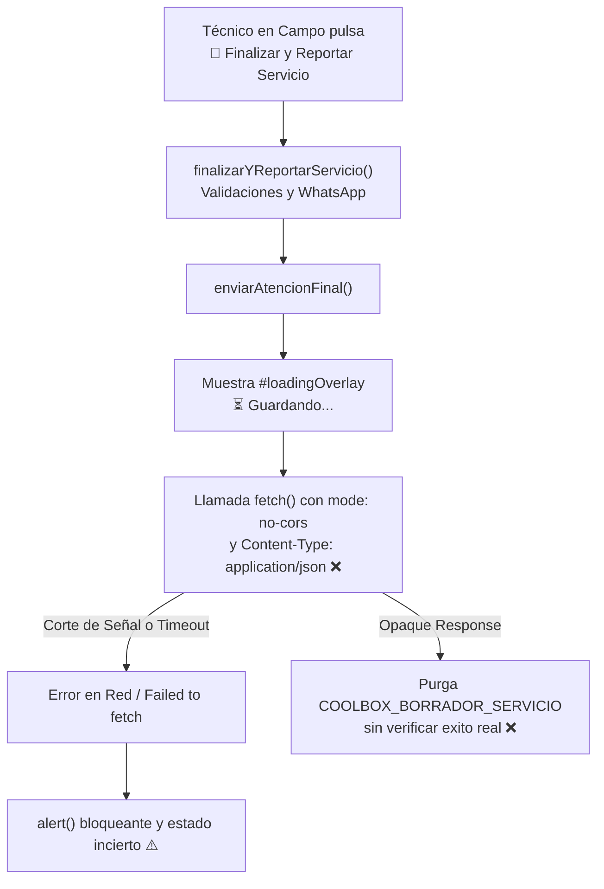
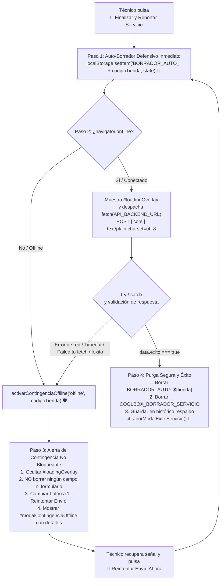

# Plan de Implementación: Paracaídas Offline y Auto-Respaldo ante Fallos de Red en App Móvil

## Resumen Ejecutivo
En cumplimiento de la **Directiva T-C-R-V: Paracaídas Offline y Auto-Respaldo ante Fallos de Red**, se audita y blinda el flujo de finalización y envío de reportes técnicos en [`index.html`](file:///c:/Users/HP/Desktop/Control%20Coolbox/index.html) (PWA Móvil del Técnico).

El objetivo es proteger íntegramente la labor en campo realizada en sótanos, centros comerciales o zonas con cobertura 4G inestable, erradicando cualquier riesgo de pérdida de información, firmas digitales o evidencias fotográficas ante caídas de conexión o excepciones `Failed to fetch`.

---

## 1. Diagnóstico y Arquitectura Actual



### Problemas Identificados:
1. **Pérdida Potencial de Datos Pre-Envío:** La persistencia del borrador se ejecutaba después de mostrar el spinner o dependía de `guardarBorrador(false)` sin una clave fija por tienda.
2. **Modo `no-cors` y `application/json`:** Provocaba respuestas opacas sin confirmación verificable de `exito: true` y riesgo de preflight HTTP OPTIONS.
3. **Purga Incondicional de Borrador:** Al recibir la respuesta opaca, el código borraba el borrador local sin saber si Google Apps Script realmente registró la atención.
4. **Falta de Detección de Red Previa (`navigator.onLine`):** Si el dispositivo está sin cobertura o en modo avión, la app intentaba enviar y fallaba de inmediato con una alerta invasiva en vez de ofrecer un reintento limpio.

---

## 2. Flujo Objetivo Blindado (Paracaídas Offline)



---

## 3. Cambios Propuestos en [`index.html`](file:///c:/Users/HP/Desktop/Control%20Coolbox/index.html)

### Componente A: Modal de Contingencia Offline (`#modalContingenciaOffline`)
Se añadirá en el DOM junto al modal de éxito [`#modalExitoServicio`](file:///c:/Users/HP/Desktop/Control%20Coolbox/index.html#L2382):
```html
<!-- MODAL / ALERTA DE CONTINGENCIA OFFLINE (PARACAÍDAS DE SEGURIDAD) -->
<div id="modalContingenciaOffline" style="display: none !important; pointer-events: none;">
  <div class="modal-resumen-card" style="max-width: 500px; text-align: center;">
    <div class="modal-resumen-header" style="justify-content: center; background: #FEF3C7; border-bottom: 2px solid #F59E0B;">
      <div class="modal-resumen-title" style="color: #92400E; font-size: 1.05rem;">
        <span>🛡️</span>
        <span>Respaldo en Memoria Seguro</span>
      </div>
    </div>
    <div class="modal-resumen-body" style="padding: 24px 20px; display: flex; flex-direction: column; align-items: center; gap: 14px;">
      <div style="width: 62px; height: 62px; border-radius: 50%; background: #FEF3C7; display: flex; align-items: center; justify-content: center; font-size: 2rem; color: #D97706; box-shadow: 0 4px 10px rgba(245, 158, 11, 0.2);">
        📶
      </div>
      <div style="font-size: 1.12rem; font-weight: 700; color: #0F172A;" id="txtContingenciaTienda">
        Reporte y Firmas Protegidos
      </div>
      <p style="font-size: 0.9rem; color: #475569; margin: 0; line-height: 1.55;" id="txtContingenciaMensaje">
        ⚠️ Conexión inestable. Tu reporte y firmas están 100% seguros y respaldados en la memoria de tu teléfono. Acércate a un punto con señal y vuelve a presionar Reintentar Enviar.
      </p>
      <div style="width: 100%; background: #F8FAFC; border: 1px dashed #CBD5E1; border-radius: 8px; padding: 12px 14px; font-size: 0.82rem; color: #334155; text-align: left; box-sizing: border-box;">
        <div style="margin-bottom: 4px;">💾 <strong>Clave de respaldo:</strong> <span id="lblClaveBorradorAuto" style="font-family: monospace; color: #0284C7;">-</span></div>
        <div style="margin-bottom: 4px;">📶 <strong>Estado de red:</strong> <span id="lblEstadoRedActual" style="font-weight: 600;">Sin conexión</span></div>
        <div>🕒 <strong>Hora de respaldo:</strong> <span id="lblHoraRespaldoAuto">-</span></div>
      </div>
    </div>
    <div class="modal-resumen-footer" style="flex-direction: column; gap: 10px; padding: 16px;">
      <button type="button" id="btnReintentarEnvioModal" class="btn btn-success" style="width: 100%; min-height: 46px; font-size: 0.96rem; font-weight: 700; background: #059669; border-color: #059669;" onclick="cerrarModalContingencia(); reintentarEnvioServicio();">
        🔄 Reintentar Envío Ahora
      </button>
      <button type="button" id="btnEntendidoModal" class="btn btn-wizard-prev" style="width: 100%; min-height: 42px; font-size: 0.9rem; font-weight: 600;" onclick="cerrarModalContingencia()">
        👍 Entendido, lo enviaré al tener señal
      </button>
    </div>
  </div>
</div>
```

---

### Componente B: Refactorización Blindada de `enviarAtencionFinal()`
Ubicada en las líneas ~7107-7370 de [`index.html`](file:///c:/Users/HP/Desktop/Control%20Coolbox/index.html):

1. **Auto-Borrador Defensivo Pre-Envío:**
   ```javascript
   const codigoTienda = (document.getElementById("selectTienda")?.value || "").trim().toUpperCase();
   const claveAutoBorrador = "BORRADOR_AUTO_" + codigoTienda;
   
   // Guardar snapshot íntegro del reporte antes de cualquier llamada de red o spinner
   try {
     const snapshotPreEnvio = {
       tienda: codigoTienda,
       payload: payload,
       fechaRespaldo: new Date().toISOString(),
       urlFotoAntes: urlFotoAntes,
       urlFotoDespues: urlFotoDespues,
       firmaTecnicoBase64: firmaTecnicoBase64,
       firmaClienteBase64: firmaClienteBase64,
       estaciones: estacionesDetalle,
       equipos: equiposCensados
     };
     localStorage.setItem(claveAutoBorrador, JSON.stringify(snapshotPreEnvio));
     localStorage.setItem("COOLBOX_BORRADOR_SERVICIO", JSON.stringify(snapshotPreEnvio));
   } catch (errQuota) {
     console.warn("Aviso de cuota en auto-borrador pre-envío:", errQuota);
   }
   ```

2. **Detección de Conexión:**
   ```javascript
   if (typeof navigator !== "undefined" && navigator.onLine === false) {
     activarContingenciaOffline("offline", codigoTienda);
     return false;
   }
   ```

3. **Despacho `fetch` con Manejo de Errores Robusto y Anti-CORS:**
   ```javascript
   document.getElementById("loadingOverlay").style.display = "flex";
   
   try {
     const resp = await fetch(API_BACKEND_URL, {
       method: "POST",
       mode: "cors",
       headers: { "Content-Type": "text/plain;charset=utf-8" },
       body: JSON.stringify(payload)
     });
     
     let data = {};
     try {
       data = await resp.json();
     } catch (eJson) {
       data = { exito: resp.ok, statusText: resp.statusText };
     }
     
     if (data && (data.exito === true || data.success === true)) {
       // Purga Segura tras Éxito
       localStorage.removeItem(claveAutoBorrador);
       localStorage.removeItem("COOLBOX_BORRADOR_SERVICIO");
       try {
         localStorage.setItem("COOLBOX_ULTIMO_ENVIO_RESPALDO", JSON.stringify(payload));
       } catch (e) {}
       actualizarBadgeBorradores();
       restaurarBotonFinalizar();
       abrirModalExitoServicio();
     } else {
       throw new Error((data && (data.mensaje || data.error)) || "El servidor no confirmó el guardado.");
     }
   } catch (errFetch) {
     console.warn("Fallo de red o servidor en fetch:", errFetch);
     
     // Fallback secundario con google.script.run si está en GAS integrado
     if (typeof google !== "undefined" && google.script && google.script.run && google.script.run.guardarAtencion) {
       google.script.run
         .withSuccessHandler((res) => {
           localStorage.removeItem(claveAutoBorrador);
           localStorage.removeItem("COOLBOX_BORRADOR_SERVICIO");
           actualizarBadgeBorradores();
           restaurarBotonFinalizar();
           abrirModalExitoServicio();
         })
         .withFailureHandler((errGAS) => {
           activarContingenciaOffline("error_red", codigoTienda);
         })
         .guardarAtencion(payload);
     } else {
       activarContingenciaOffline("error_red", codigoTienda);
     }
   } finally {
     document.getElementById("loadingOverlay").style.display = "none";
   }
   ```

---

### Componente C: Funciones de Control de Contingencia y Reintento
1. `activarContingenciaOffline(motivo, codigoTienda)`:
   - Oculta el spinner de carga.
   - Preserva al 100% todos los inputs, checklists, censo, fotos y firmas en el DOM y en memoria (cero reseteos).
   - Transforma el botón `#btnFinalizarReportar` a `"🔄 Reintentar Envío"` (estilo ámbar destacado).
   - Abre `#modalContingenciaOffline` poblando los campos informativos.
2. `cerrarModalContingencia()`:
   - Cierra el modal de contingencia.
3. `reintentarEnvioServicio()`:
   - Cierra el modal de contingencia y re-ejecuta `enviarAtencionFinal()`.
4. `restaurarBotonFinalizar()`:
   - Restablece el texto de `#btnFinalizarReportar` a `"🚀 Finalizar y Reportar Servicio"` y estilos originales.

---

## 4. Reglas Inmutables y Validación
1. **Preservación Multimedia:** Se conservan intactas las cadenas Base64 de los logos en las líneas 1716 y 1721.
2. **Cero Impacto en Compresión:** La compresión Canvas preexistente de firmas y fotos no sufre ninguna alteración.
3. **Garantía No Destructiva:** Ningún dato se borra del formulario ni de `localStorage` mientras la respuesta no sea `{ exito: true }`.

---

## 5. Plan de Verificación

### Pruebas Automatizadas (Node.js Sandbox)
Crear `scratch/test_paracaidas_offline.js`:
1. **Invarianza de Logotipos:** SHA-256 intacto.
2. **Sintaxis de JavaScript:** Verificación con `vm.Script`.
3. **Simulación Offline (`navigator.onLine = false`):**
   - Verificar que se cree `BORRADOR_AUTO_B13` en `localStorage`.
   - Verificar que no se haga llamada a `fetch`.
   - Verificar que `#loadingOverlay` esté oculto.
   - Verificar que `#btnFinalizarReportar` cambie a `"🔄 Reintentar Envío"`.
   - Verificar que el modal de contingencia se active con el mensaje exacto requerido.
4. **Simulación de Falla de Red (`Failed to fetch` / Timeout):**
   - Con `navigator.onLine = true`, simular que `fetch` lanza un error de red (`TypeError: Failed to fetch`).
   - Comprobar que los datos permanezcan en `localStorage`.
   - Comprobar que no se vacíe ningún campo.
   - Comprobar que se muestre el modal de contingencia.
5. **Simulación de Envío Exitoso (`exito: true`):**
   - Comprobar que al recibir `{ exito: true }`, se purgue `BORRADOR_AUTO_B13` y `COOLBOX_BORRADOR_SERVICIO`.
   - Comprobar que se abra `#modalExitoServicio`.
   - Comprobar que el botón se restaure a su estado inicial.

---

## Preguntas Abiertas / Confirmación del Usuario
¿Está de acuerdo con la estrategia de contingencia no bloqueante y la estructura del plan para proceder con la implementación inmediata en [`index.html`](file:///c:/Users/HP/Desktop/Control%20Coolbox/index.html)?
