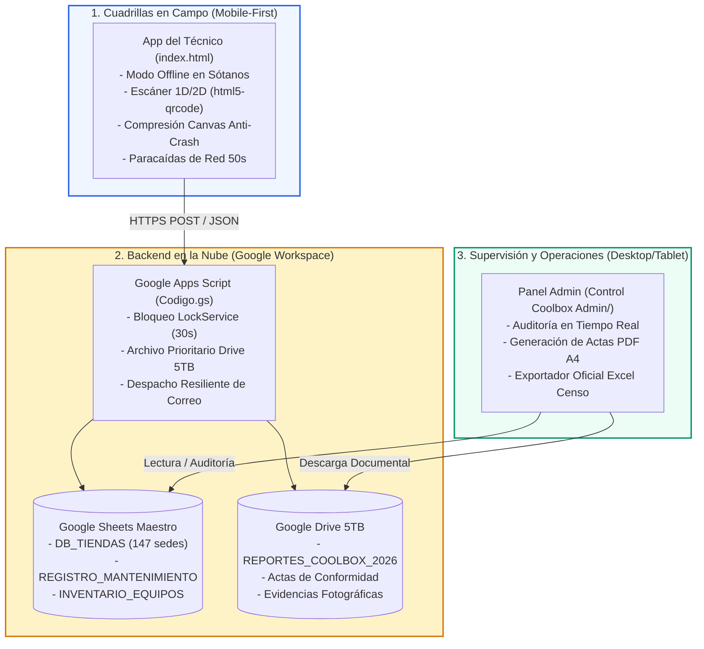

# JService Ops 2026 for Coolbox (`v4.6.5 Pro`)

> **Sistema Integral de Control Operativo de Mantenimiento Preventivo, Auditoría de Infraestructura y Censo Anual de Hardware 2026**

---

## 🏢 Información Corporativa

* **Empresa Ejecutora:** **JSERVICE RV E.I.R.L.**
* **Cliente Mandante:** **Coolbox (RASH PERÚ S.R.L.)**
* **Alcance Nacional:** 147 tiendas retail (88 en Lima Metropolitana / Callao y 59 en Provincias).
* **Ventana de Ejecución:** Campaña Nacional Anual 2026.
* **Infraestructura Cloud:** Google Workspace (Google Sheets + Google Drive 5 TB + Google Apps Script V8).
* **Costo de Servidores:** **$0.00 USD** (Arquitectura 100% Serverless de alta disponibilidad).

---

## 🚀 Arquitectura del Ecosistema

El sistema opera bajo un esquema desacoplado de dos capas principales:

---

## 📱 Componentes Principales

### 1. Aplicación Web del Técnico (`index.html`)
* **Mobile-First Responsive:** Diseñada para uso ágil en smartphones (Google Chrome en Android / Safari en iOS).
* **Paracaídas de Conexión Offline:** Persistencia inmediata en `localStorage` con autoguardado a prueba de pérdida de señal en sótanos o cuartos de racks blindados.
* **Escaneo 1 a 1 de Hardware:** Motor de lectura de códigos de barra y QR integrado localmente (`html5-qrcode.min.js`), con fallback manual por teclado.
* **Protección de Memoria RAM:** Liberación forzada de buffers Canvas tras comprimir fotografías, evitando cierres inesperados en teléfonos de gama de entrada (2GB / 3GB RAM).
* **Watchdog de Red Calibrado:** Temporizador centinela de 50 segundos con mensajes progresivos de estado a los 20 segundos para conexiones 3G/4G lentas en provincias.

### 2. Panel de Supervisión y Control (`Control Coolbox Admin/index.html`)
* **KPIs en Tiempo Real:** Monitoreo del avance de atención sobre las 147 tiendas a nivel nacional.
* **Generador de Actas Oficiales:** Emisión de Actas de Conformidad y Fichas Técnicas consolidadas en formato imprimible A4 con motor `html2pdf`.
* **Exportador Oficial Excel:** Exportación del Censo Tecnológico con doble paleta corporativa idéntica a la plantilla oficial de RASH PERÚ.

### 3. Backend Transaccional (`Codigo.gs`)
* **Motor V8 Google Apps Script:** Despacho seguro de peticiones `POST` desde campo.
* **Control de Concurrencia:** Protección de escritura en Google Sheets mediante `LockService.getScriptLock()` con timeout de 30,000 ms.
* **Almacenamiento Prioritario en Drive (5 TB):** Resguardo permanente de actas y evidencias fotográficas antes del chequeo de cuotas de correo.

---

## 🔒 Reglas de Oro Operativas (Inviolables)

1. 🚫 **Prohibición Absoluta de Peinado de Cables:** Queda terminantemente prohibido desconectar, peinar o modificar el ordenamiento de cableado en el rack de comunicaciones. Alcance restringido a: inspección visual, soplado de polvo, verificación de PDU/extractores y toma de fotos (Antes y Después).
2. 📷 **Evidencia Obligatoria de Gabinete:** Obligatoriedad de capturar fotografías 'Antes' y 'Después' antes de permitir el cierre de atención.
3. 🔍 **Censo 1 a 1 y Cero Filas Fantasma:** Dispositivos no presentes en la sede física son omitidos automáticamente sin crear registros vacíos.

---

## 🛠️ Hardware Homologado

* **Terminales Móviles (PDAs):** SUNMI, SHIJI, HONEYWELL, UNITECH.
* **Ticketeras Térmicas:** Epson TM-T20 (II / III / IV), Bixolon (SRP-330 / SRP-350).
* **Estaciones de Trabajo:** Computadoras All in One (AIO) y PC Desktop HP / Lenovo.
* **Periféricos:** Lectores de código de barras USB, Gavetas de dinero RJ11/12, Lectores biométricos (huelleros).

---

## 👥 Equipo Responsable

* **Jefatura de Operaciones:** Andrews Berbesia (Supervisión Central)
* **Supervisión Operativa en Perú:** Jesús Silva (Coordinación de Cuadrillas)
* **Desarrollo y Arquitectura de Software:** JSERVICE RV E.I.R.L.

---
*© 2026 JSERVICE RV E.I.R.L. Todos los derechos reservados. Confidencial para uso operativo en Coolbox (RASH PERÚ S.R.L.).*
